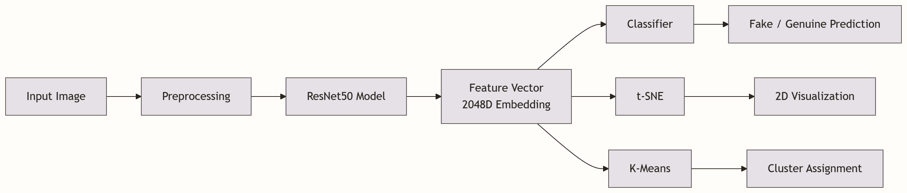
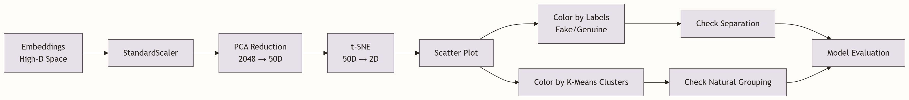
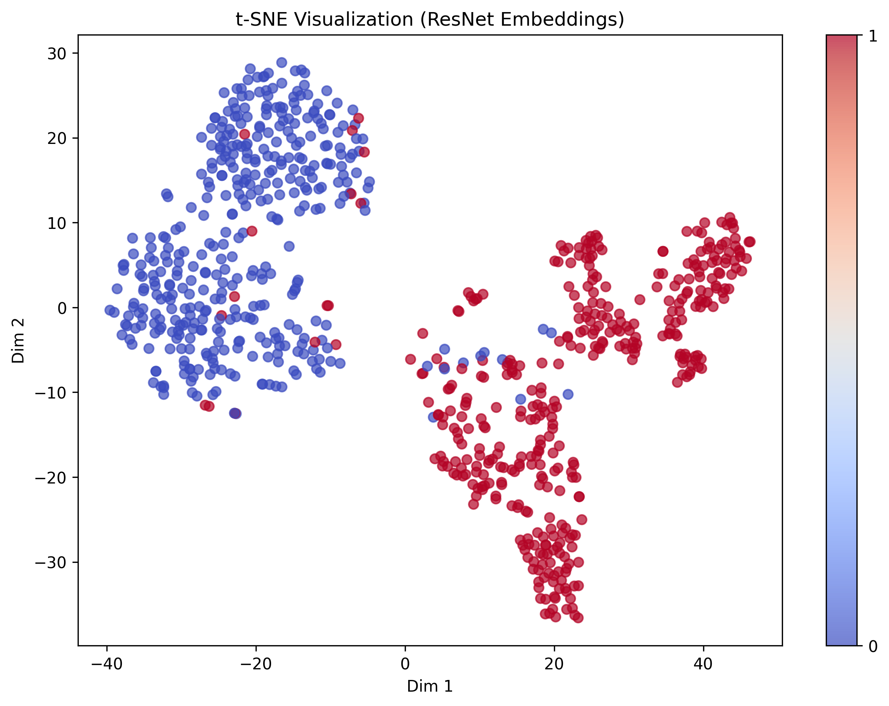
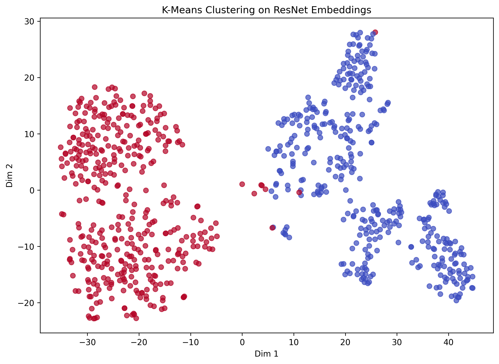
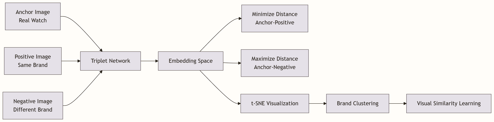
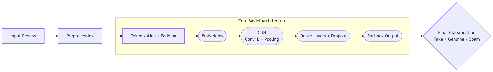
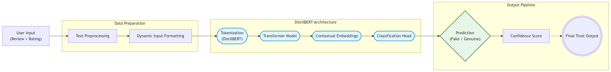
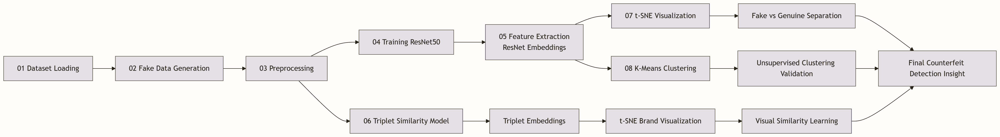

# 🛡️ TrustFilterAI

**TrustFilterAI** is a full-stack AI-powered platform designed to ensure **trust and authenticity in e-commerce systems** by detecting:

- Fake product reviews  
- Subtle spam and manipulation  
- Counterfeit products using image-based analysis  

The system combines **Transformer-based NLP, Computer Vision, and full-stack engineering** into a unified trust and moderation pipeline.

---

# Project Overview

TrustFilterAI started as a HackOn prototype and evolved into a **real-world multi-modal ML system** focused on ensuring **trust and authenticity in e-commerce platforms**.

The system addresses two key problems:
- Detecting **fake and manipulative reviews (NLP)**
- Identifying **counterfeit products using visual signals (Computer Vision)**

### Key Focus Areas
- Dataset engineering and robustness on noisy real-world data  
- Model generalization across diverse inputs  
- Explainability through embedding visualization (t-SNE)  
- Scalable and modular ML pipeline design  
- Full-stack AI integration  

The project has progressed from a **CNN-based baseline (V1)** to a **Transformer-based DistilBERT model (V2)**, and also includes a **Computer Vision pipeline for counterfeit detection using ResNet embeddings and clustering techniques**.

📎 [HackOn Pitch Deck](https://drive.google.com/file/d/1_PmpqlBncIugI3_VDfuKnpe6W8DS2LV9/view?usp=sharing)


---

# Core Modules

## 1. Fake Review Detection (NLP)

### V1: CNN-based Review Classification

- Built a **Convolutional Neural Network (CNN)** model using **TensorFlow/Keras** for text classification  
- Takes a raw **input review** and processes it through a complete NLP pipeline:
  - Preprocessing (cleaning, normalization)  
  - Tokenization and sequence padding  
  - Embedding layer for semantic representation  
  - CNN (Conv1D + pooling) for feature extraction  
- Classifies reviews into:
  - Genuine  
  - Fake  
  - Spam (including subtle and hard-to-detect spam)

- Designed to handle **real-world noisy data** using balanced and augmented datasets  
- Evaluated using **precision, recall, and F1-score** to ensure robust performance beyond accuracy  
#### V1 Model Performance

| Metric | Value |
|------|------|
| Test Accuracy | ~91–93% |
| Precision / Recall | Balanced |
| Generalization | High |

#### Performance

| Metric | Value |
|------|------|
| Test Accuracy | ~91–93% |
| Precision / Recall | Balanced |
| Generalization | High |

---

### V2: DistilBERT-based Review Analysis

- Transformer-based model using **DistilBERT**
- Captures **contextual and semantic relationships**

#### Improvements over V1
- Better understanding of context  
- Detects subtle spam and manipulation  
- Handles rating-text inconsistencies  

#### Model Design
- Base: `distilbert-base-uncased`  
- Binary classification (Fake / Genuine)  

#### Training Strategy
- 10,000 samples  
- 75% clean + 25% noisy data  
- Duplicate removal to prevent leakage  

#### Performance

| Metric | Value |
| :--- | :--- |
| Accuracy | 98% |
| F1 Score | ~0.99 |
| Avg Confidence | 0.96 |

#### Confusion Matrix
```text
[[4302    7]
 [ 133 5558]]
```

---

### V1 vs V2 Comparison

| Feature | CNN (V1) | DistilBERT (V2) |
| :--- | :--- | :--- |
| **Context Understanding** | Limited | Strong |
| **Handling Subtle Spam** | Moderate | High |
| **Generalization** | Good | Excellent |
| **Architecture** | CNN | Transformer |
| **Accuracy** | ~92% | ~98% |

---

---

## 2. Counterfeit Image Detection (Computer Vision)

This module introduces **visual counterfeit detection** using deep learning and embedding-based analysis. It focuses on learning meaningful image representations and validating their effectiveness through visualization and clustering techniques.

---

### Feature Extraction
- Pretrained **ResNet50** used as a feature extractor  
- Converts images into **2048-dimensional embeddings**  
- Captures high-level visual patterns such as texture, shape, and design  



---

## Clustering & Visualization

### Pipeline Overview



---

### t-SNE Visualization

- Reduces dimensionality:
  - **2048D → 50D (PCA) → 2D (t-SNE)**  
- Used to:
  - Visualize embedding structure  
  - Inspect separation between **fake and genuine images**  

- Label Mapping:
  - **0 → Fake**
  - **1 → Genuine**

* Result: **Clear cluster separation between fake and genuine images**



---

### K-Means Clustering

- Applied **unsupervised clustering** on embeddings  
- Evaluates whether:
  - Fake and genuine images form **natural clusters**  

* Result: **Clusters align well with true labels, confirming strong feature separability**



---

## Triplet Similarity Learning

- Implemented **triplet-based similarity learning** on watch image embeddings  

- Input structure:
  - **Anchor image:** real watch  
  - **Positive image:** same brand (visually similar)  
  - **Negative image:** different brand (visually different)  

- Learning objective:
  - Minimize distance between **anchor and positive**  
  - Maximize distance between **anchor and negative**  

- Uses:
  - **Cosine similarity** for embedding comparison  

- Enables:
  - Brand-level clustering of watch images  
  - Visual similarity learning across different designs  
  - Structured embedding space for better separation  

* Produces meaningful embedding space where similar watch brands cluster together and dissimilar ones are separated.



---

## Advanced Dataset Engineering

- Synthetic review generation  
- Hard/ambiguous sample creation  
- Subtle spam injection  
- Real-world dataset integration (~40K reviews subset)

---


# ML Pipeline

### V1: CNN Review Classification Pipeline


### V2: DistilBERT Review Classification Pipeline


--- 

### Counterfeit Detection Pipeline (Computer Vision)


---

## Tech Stack

| Layer | Technologies |
|------|------------|
| Frontend | React.js |
| Backend | Node.js, Express.js |
| Database | MongoDB |
| ML Framework | PyTorch, TensorFlow/Keras |
| NLP | DistilBERT, CNN (V1) |
| Computer Vision | ResNet50 |
| Data & ML Tools | NumPy, Pandas, Scikit-learn |
| Visualization | Matplotlib, t-SNE |
| Techniques | Triplet Loss, Clustering, PCA |

---

# Project Structure

```text
TrustFilterAI/
├── assets/
│   ├── cnn_pipeline.png
│   └── DistilBERT_Pipeline_V2.png
├── backend/
├── frontend/
├── ml/
│   ├── counterfeit_detection/
│   │   ├── notebooks/
│   │   │   ├── 01_dataset_loading.ipynb
│   │   │   ├── 02_fake_data_generation.ipynb
│   │   │   ├── 03_preprocessing.ipynb
│   │   │   ├── 04_training_resnet50.ipynb
│   │   │   ├── 05_evaluation_demo.ipynb
│   │   │   ├── 06_triplet_similarity.ipynb
│   │   │   ├── 07_clustering_visualization.ipynb
│   │   │   └── 08_kmeans_clustering.ipynb
│   │   ├── outputs/
│   │   │   └── plots/
│   │   └── requirements.txt
│   ├── text/
│   │   └── keras_cnn/
│   └── V2/
│       ├── data/
│       │   ├── processed/
│       │   └── raw/
│       ├── notebooks/
│       │   ├── 01_data_preprocessing.ipynb
│       │   ├── 02_model_training_distilbert.ipynb
│       │   └── 03_model_evaluation_and_demo.ipynb
│       └── src/
├── LICENSE
└── README.md
```
---

# ⚙️ Setup Instructions

### 1. Clone Repository

```bash
git clone [https://github.com/Amil2006/TrustFilterAI.git](https://github.com/Amil2006/TrustFilterAI.git)
cd TrustFilterAI
```

### 2. Backend Setup

```bash
cd backend
npm install
node server.js
```

### 3. Frontend Setup

```bash
cd frontend
npm install
npm start
```

### 4. ML Setup

```bash
python -m venv .venv
.venv\Scripts\activate
pip install -r ml/counterfeit_detection/requirements.txt
```

### 5. Train Models

**NLP Model Execution**

**V1 (CNN Model)**
```bash
python ml/text/keras_cnn/train.py
```
**V2(DistilBERT Model) Run the training notebook**
```bash
jupyter notebook ml/V2/notebooks/02_model_training.ipynb
```
**Counterfeit Detection (Computer Vision)**
```bash
jupyter notebook ml/counterfeit_detection/notebooks/06_triplet_similarity.ipynb
jupyter notebook ml/counterfeit_detection/notebooks/07_clustering_visualization.ipynb
jupyter notebook ml/counterfeit_detection/notebooks/08_kmeans_clustering.ipynb
```

### 6.Evaluation & Demo
```bash
jupyter notebook ml/V2/notebooks/03_model_evaluation_and_demo.ipynb
```

## Example Output

```json
{
  "label": "fake",
  "confidence": 0.91
}
```

# Evaluation Metrics

### NLP (Review Detection)
- Accuracy  
- Precision / Recall  
- F1 Score  
- Confusion Matrix  
- Class-wise performance analysis  

### Computer Vision (Counterfeit Detection)
- t-SNE cluster separation (visual evaluation)  
- K-Means clustering accuracy  
- Embedding separability analysis  
- Misclassification / overlap analysis  

---

# Key Learning Outcomes

- Data quality and distribution significantly impact model performance  
- Importance of preventing data leakage in ML pipelines  
- Transition from CNN → Transformer-based NLP (DistilBERT)  
- Feature extraction using pretrained CNNs (ResNet50)  
- Understanding embedding spaces through t-SNE visualization  
- Validating model robustness using unsupervised clustering (K-Means)  
- Handling real-world noisy and ambiguous data  
- Designing modular, scalable ML pipelines  
- Evaluating models beyond accuracy (F1, clustering alignment, confidence)  
- Balancing performance with interpretability  

---

# Upcoming Modules

### Unified Trust Scoring Engine
* Combines:
  * Review analysis (DistilBERT)
  * Image similarity (ResNet50)
  * Rule-based signals (pattern detection)
* Generate a simple **trust score (0–100)** per product
* Designed for real-time moderation systems  

---
### Full-Stack Integration

- Expose ML models as APIs and integrate with Node.js backend  
- Enable real-time review and image analysis  
- Build dashboard for fake vs genuine insights and product-level monitoring  

---

## 📌 License
MIT License